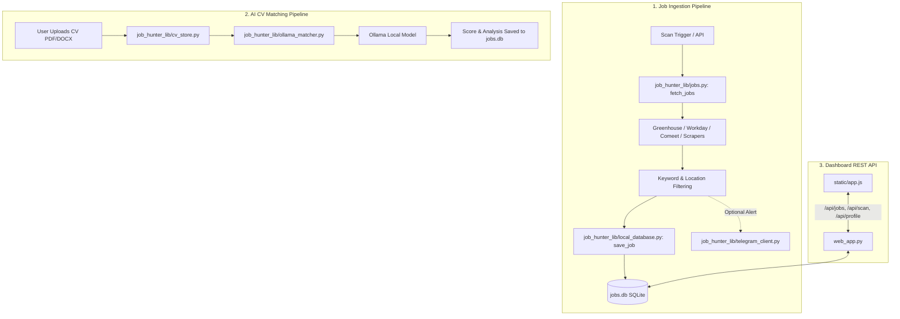

# AGENTS.md

> Developer & AI Agent Guide to the Job Hunter Codebase.

This document outlines the architecture, tech stack, directory structure, critical execution paths, and agent guidelines for working within this workspace.

---

## 1. Tech Stack & Frameworks

### Backend & Core
- **Language & Runtime:** Python 3.10+ (standard deployment on Python 3.11–3.14).
- **Web Framework:** Flask (`web_app.py`) providing a RESTful JSON API and serving the Single Page Application.
- **HTTP / Async Client:** `httpx` (asynchronous HTTP/1.1 and HTTP/2 client for high-concurrency job fetching).
- **HTML & Document Parsing:** `beautifulsoup4` (DOM/HTML scraping), `pypdf` (PDF text extraction), `python-docx` (Word document parsing).
- **Local Persistence:** SQLite (`jobs.db`) managed via Python's standard `sqlite3` driver (`job_hunter_lib/local_database.py`, `job_hunter_lib/cv_store.py`).
- **Cloud / Secondary DB:** PyMongo (`pymongo[srv]`, `dnspython`) for optional MongoDB storage (`job_hunter_lib/database.py`).
- **AI & LLM Matching:** Ollama HTTP REST API (`job_hunter_lib/ollama_matcher.py`) supporting local models (e.g. `llama3`, `mistral`, `qwen2.5`, `deepseek-r1`).
- **Messaging & Notifications:** `python-telegram-bot[job-queue]` (`job_hunter_lib/telegram_client.py`, `bot_handler.py`).
- **Testing:** `pytest` configured via `pytest.ini`.

### Frontend
- **Architecture:** Lightweight Single Page Application (SPA) with tab-based routing (`Dashboard`, `Jobs`, `Companies`, `CV & Profile`, `Settings`).
- **Stack:** Vanilla JavaScript ES6+ (`static/app.js`), semantic HTML5 (`templates/index.html`), custom CSS3 with design tokens (`static/styles.css`).
- **Visualizations:** Chart.js loaded via CDN. No Node.js build step or bundler required.

---

## 2. Directory Structure & Scope

```
job-hunter/
├── job_hunter_lib/              # Primary business logic & core engine
│   ├── config.py                # Company registries, ATS metadata, keyword filters, location lists
│   ├── fetchers.py              # Platform-specific parsers & scrapers (Greenhouse, Workday, Comeet, etc.)
│   ├── jobs.py                  # Job ingestion orchestrator, concurrency pools, auto-detection engine
│   ├── local_database.py        # SQLite schema, job CRUD, match caching, company analytics, migrations
│   ├── cv_store.py              # User CV profile, document parsing (PDF/DOCX), prompt preferences
│   ├── ollama_matcher.py        # Ollama LLM integration, prompt templates, structured scoring
│   ├── scoring.py               # Keyword & rule-based scoring fallback
│   ├── telegram_client.py       # Telegram message formatters, inline button keyboards, API dispatcher
│   ├── database.py              # MongoDB driver layer (legacy/optional remote sync)
│   └── utils.py                 # Job ID hashing, string sanitization, text trimming
├── templates/
│   └── index.html               # Jinja2 template for the web dashboard SPA
├── static/
│   ├── app.js                   # Frontend controller, API client, UI rendering, event listeners
│   └── styles.css               # Modern dark-mode UI stylesheet
├── web_app.py                   # Main Flask web application & REST API server
├── job_hunter.py                # CLI runner for one-shot scans & Telegram alerts
├── scheduler.py                 # Background scheduler for recurring automated scans
├── scheduled_ai_hunt.py         # End-to-end automated hunt pipeline with Ollama CV matching
├── bot_handler.py               # Telegram bot interactive command handler
├── test_*.py                    # Unit and integration test suites
├── pytest.ini                   # Pytest configuration and markers
├── requirements.txt             # Python dependencies
├── jobs.db                      # Local SQLite database (binary dataset)
└── AGENTS.md                    # Agent architecture and execution guidelines
```

---

## 3. Entry Points & Critical Paths

### Starting the Applications
- **Web UI & API Server:**
  ```bash
  python web_app.py
  # Serves the Flask app at http://127.0.0.1:5001
  ```
- **CLI One-Shot Job Hunt:**
  ```bash
  python job_hunter.py
  ```
- **AI Automated Match Hunt:**
  ```bash
  python scheduled_ai_hunt.py
  ```
- **Interactive Telegram Bot:**
  ```bash
  python bot_handler.py
  ```

### Critical Execution Flows



1. **Job Ingestion & Parsing (`fetch_jobs`):**
   - Dispatches parallel tasks across all registered companies in `job_hunter_lib/config.py` using `httpx.AsyncClient`.
   - Separate semaphore pools isolate fast API sources (concurrency 6) from slow HTML scraping sources (concurrency 2).
   - Results are normalized, filtered against `TITLE_EXCLUDED_KEYWORDS` and location lists, deduplicated by deterministic hash `job_id`, and persisted into `jobs.db`.
2. **Auto-Detection & Company Registry:**
   - `job_hunter_lib/jobs.py: auto_detect_company_ats` probes candidate URLs (Greenhouse, Comeet, Workday, SmartRecruiters, Ashby, HTML career pages) to detect ATS platforms automatically.
   - Dynamic user-added companies are persisted in the `custom_companies` table in `jobs.db`.
3. **AI CV Match Scoring:**
   - `job_hunter_lib/cv_store.py` extracts raw text from PDF/DOCX resumes.
   - `job_hunter_lib/ollama_matcher.py` builds structured prompts comparing profile skills with job descriptions and parses JSON score results (`fit_score`, `key_strengths`, `missing_skills`, `recommendation`).

---

## 4. Agent Execution Guidelines

### Files to Modify
- **Core Library:** Edit `job_hunter_lib/` for fetchers, schema updates, AI matching, or configuration additions.
- **Web Backend:** Edit `web_app.py` for new API routes or server behaviors.
- **Frontend UI:** Edit `templates/index.html`, `static/app.js`, or `static/styles.css`.
- **Tests:** Add/update test cases in `test_fetchers.py` or `test_local_database.py`.

### Files & Folders to SKIP during Reasoning
- **`jobs.db`**: Binary SQLite database (~20MB). **NEVER** view or edit `jobs.db` as raw text. Access it only via Python `sqlite3` or test scripts.
- **`.venv/`**: Python virtual environment. Do not index, search, or modify files inside.
- **`__pycache__/` & `.pytest_cache/`**: Python/pytest bytecode and cache directories.
- **`.env`**: Secrets and tokens (Telegram bot tokens, MongoDB URIs). Read `.env.example` to understand configuration variables without exposing credentials.

### Coding & Architectural Rules
- **Async Concurrency:** Always use asynchronous HTTP requests (`httpx.AsyncClient`) inside `job_hunter_lib/fetchers.py` and `job_hunter_lib/jobs.py`. Do not introduce blocking `urllib.request` or `requests` calls.
- **Graceful Error Handling:** Job fetchers must handle network timeouts, HTTP 403/404, or malformed DOM structures without crashing the entire scan. Use `format_source_error()` and return `([], 0)` on fatal source failure.
- **Database Schema Migrations:** `job_hunter_lib/local_database.py: init_local_db` uses `CREATE TABLE IF NOT EXISTS` and `ALTER TABLE ... ADD COLUMN` try-except blocks. Maintain backward compatibility when adding new database columns.
- **Test Validation:** Always execute non-network tests after modifications to ensure stability:
  ```bash
  pytest -m "not integration"
  ```
