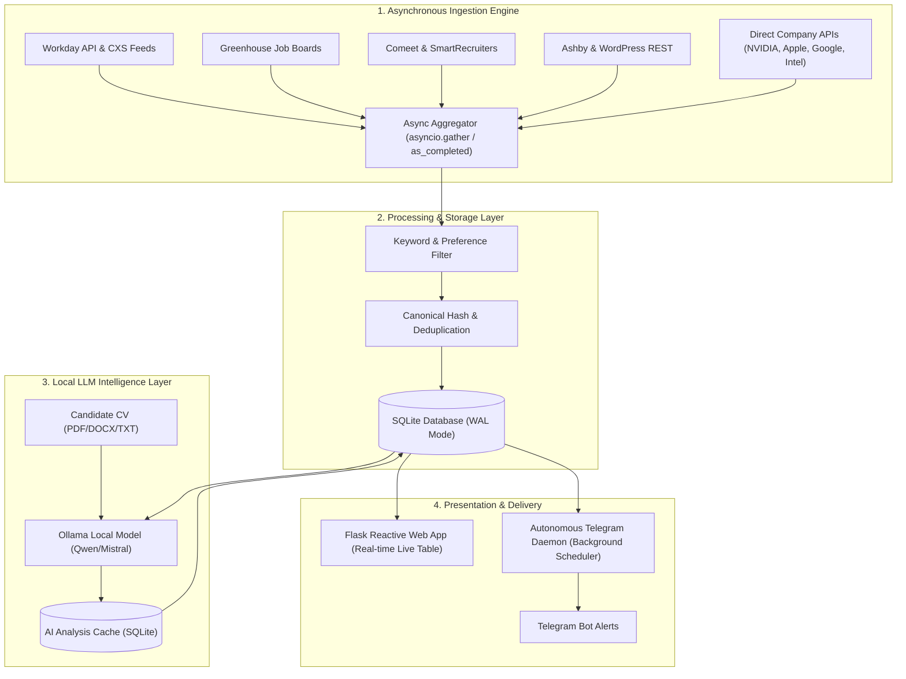

# 🎯 JobHunter: AI-Powered Career Intelligence Platform

[](https://www.python.org/)
[](https://flask.palletsprojects.com/)
[](https://ollama.com/)
[](https://docs.python.org/3/library/asyncio.html)
[-003B57?logo=sqlite&logoColor=white)](https://www.sqlite.org/)
[](https://core.telegram.org/bots/api)
[](https://docs.pytest.org/)

An enterprise-grade, asynchronous job discovery and automated recruitment pipeline. **JobHunter** aggregates openings across **80+ top tech companies and ATS platforms** in real-time, matches them against user CVs using **local LLMs (Ollama)** with zero cloud costs and 100% privacy, and delivers instant notifications via a **reactive web dashboard** and **Telegram bot**.

---

## 🌟 Key Highlights for Recruiters & Engineers

- **⚡ High-Throughput Asynchronous Crawling**: Concurrent async pipeline (`asyncio` + `httpx`) scraping 80+ career portals (Workday, Greenhouse, Comeet, SmartRecruiters, Ashby, custom APIs) in under 15 seconds.
- **🧠 100% Private Local AI Scoring**: Powered by Ollama (`qwen3.8` / `mistral`). CVs and candidate profiles never leave your machine. Features multi-factor semantic evaluation (technical skills, experience delta, missing prerequisites, role alignment).
- **🔄 Live Incremental Database Streaming**: Results stream dynamically into a local SQLite database with duplicate detection, updating the UI table in real time as each company scraper completes.
- **🛡️ Deterministic Canonical Deduplication**: Proprietary URL normalization and slug hashing engine that prevents duplicate records across varying locations or query parameters.
- **📊 Real-time Reactive Web UI**: Zero-dependency, modern dark-themed SPA featuring live search filters, company metrics, AI match explanations, and job state lifecycles (`NEW` → `SEEN X2` → `SEEN X3` → `APPLIED` / `SAVED`).
- **🤖 Autonomous Telegram Bot & Daemon**: Background scheduler running automated delta scans, silent baselines, and multi-channel alerting with inline keyboard callbacks.

---

## 🏗️ System Architecture



---

## 🛠️ Technology Stack

| Layer | Technologies & Libraries |
|---|---|
| **Backend Core** | Python 3.11+, `asyncio`, `httpx` (async HTTP/2 client), `threading`, `contextvars` |
| **Web Framework & API** | Flask, RESTful Endpoints, Long-polling Task State Machine |
| **AI / Machine Learning** | Ollama, Local LLMs (`qwen3.8:latest`, `mistral`, `llama3`), Prompt Engineering, In-memory Parsing |
| **Document Processing** | `PyPDF2`, `python-docx`, regex-based semantic keyword extractors |
| **Database & Caching** | SQLite3 with WAL mode, JSON-based payload storage, automated schema migrations |
| **Frontend Architecture** | Modern Vanilla JavaScript (ES6+), CSS3 Variables / Glassmorphism UI, Reactive State Management |
| **External Integrations** | Telegram Bot API (Webhooks & Long Polling with inline buttons) |
| **Testing & QA** | `pytest`, `pytest-asyncio`, `anyio`, mock integration suites |
| **DevOps & Containers** | Docker, multi-stage Dockerfile, `.env` security management |

---

## 💡 Core Engineering Decisions

### 1. Adaptive Rate Limiting & Asynchronous Concurrency
* Utilizes dual-tiered `asyncio.Semaphore` barriers (fast vs. rate-limited slow feeds) to prevent upstream HTTP 429 throttling while maintaining maximum parallel throughput.
* Employs exponential backoff retry mechanisms (`asyncio.sleep`) on transient network drops.

### 2. Zero-Cloud Privacy with Local LLMs
* Traditional AI job search tools transmit sensitive CVs to third-party cloud APIs (OpenAI/Anthropic).
* **JobHunter** runs 100% locally via Ollama. It analyzes candidates' resumes against job requirements and responsibilities, extracting structured JSON summaries detailing **Strong Matches**, **Partial Matches**, and **Critical Missing Requirements**.

### 3. Canonical Job Hashing & State Transitions
* Job feeds often alter location strings (e.g. `"Tel Aviv"` vs `"Tel Aviv, Israel"`), which normally leads to duplicate database records.
* Implemented a canonical URL sanitizer that strips tracking tokens, dynamic query parameters, and hashes invariant job identifiers into deterministic MD5 keys.
* Automatic lifecycle tracking:
  - **1st Scan**: Categorized as `NEW` (with distinct badge).
  - **2nd+ Scans**: Increments `appearance_count` (`SEEN X2`, `SEEN X3`) and transitions status to `OLD`.
  - **User Actions**: Explicit `SAVED` or `APPLIED` statuses are preserved across all future scans.

### 4. Live Table Streaming
* Rather than blocking the user until all 80+ companies finish scraping, an asynchronous callback streams batches into SQLite as each scraper finishes, allowing the web UI to render new openings incrementally within hundreds of milliseconds.

---

## 🚀 Quick Start Guide

### Prerequisites
1. **Python 3.11+**
2. **Ollama** (for local AI analysis)
   ```bash
   ollama pull qwen3.8
   ollama serve
   ```

### 1. Clone & Setup Environment
```bash
git clone https://github.com/bhaasobh/job-hunter.git
cd job-hunter

python3 -m venv .venv
source .venv/bin/activate
pip install -r requirements.txt
```

### 2. Configure Environment Variables
```bash
cp .env.example .env
```
*(Optional: add your Telegram Bot Token & Chat ID in `.env` if you want mobile notifications).*

### 3. Launch the Web Application
```bash
python web_app.py
```
Open **`http://127.0.0.1:5050`** in your browser.

---

## 🧪 Testing & Code Quality

The project includes unit and integration tests verifying fetchers, database integrity, and state machines:

```bash
# Run unit tests
pytest -m "not integration"

# Run all tests (including live company endpoints)
pytest
```

---

## 📂 Project Structure

```text
├── web_app.py                 # Flask web server, REST API, & background task manager
├── scheduled_ai_hunt.py       # Autonomous AI scheduler & Telegram daemon
├── scheduler.py               # Periodic search runner
├── job_hunter.py              # CLI entry point
├── job_hunter_lib/
│   ├── fetchers.py            # 80+ Async scraper modules (Workday, Greenhouse, Comeet, etc.)
│   ├── jobs.py                # Job orchestration engine, section extractor, and CV keyword parser
│   ├── local_database.py      # SQLite operations, hygiene cleanup, and state transitions
│   ├── ollama_matcher.py      # Local LLM prompt engineering, JSON validation, & analysis caching
│   ├── cv_store.py            # PDF/DOCX/TXT resume parser and keyword analyzer
│   ├── telegram_client.py     # Telegram Bot API client & interactive keyboard builder
│   ├── config.py              # Company configurations, search keywords, and endpoints
│   └── utils.py               # Deterministic URL canonicalizer & text sanitizers
├── static/
│   ├── app.js                 # Reactive frontend SPA state manager and event handlers
│   └── styles.css             # Responsive modern dark-theme design system
├── templates/
│   └── index.html             # Single-page application markup
└── tests/
    ├── test_fetchers.py       # Scraper and preference tests
    ├── test_local_database.py # State transitions and database integrity tests
    └── test_website_all_jobs.py # End-to-end integration tests
```

---

## 👤 Author

**Bahaa Sobh**
- GitHub: [@bhaasobh](https://github.com/bhaasobh)
- Email: [bhaasobh47@gmail.com](mailto:bhaasobh47@gmail.com)

---

## 📄 License
This project is open source and available under the [MIT License](LICENSE).
